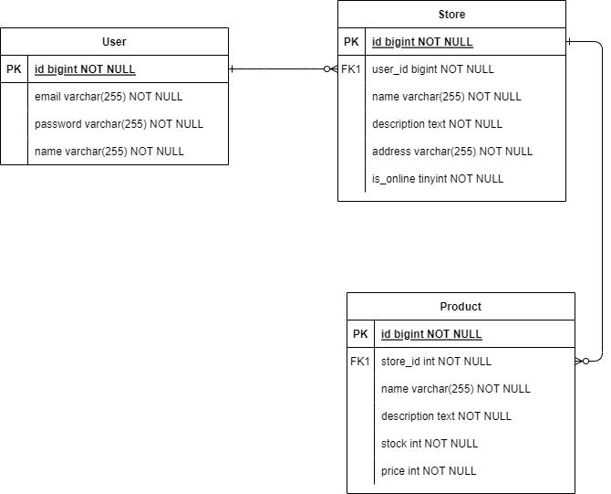
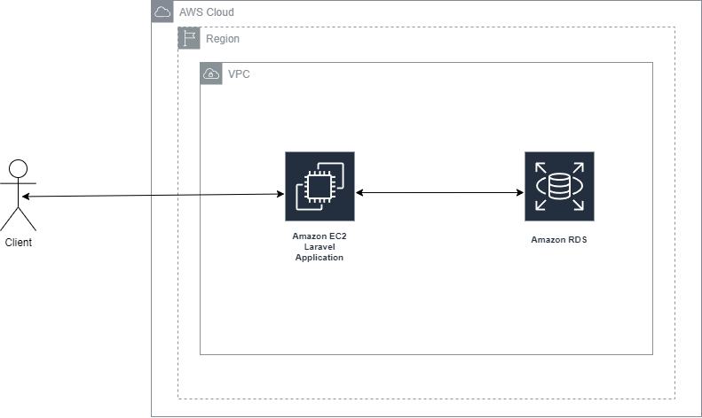

# Summary 
## What this project is about
- A web application providing RESTAPIs using Laravel framework.
## What i use, have done in this project
- Using Laravel Sanctum for token-based authentication  
- Implemented Service and Repository Layers (Controller -> Service -> Repository -> Model)  
- Validating requests  
- Error Handling, added ``CheckErrorCode`` trait to support this  
- Using Laravel Localization for multi languages response messages, added ``SetAppLocale`` middleware to support this  
- Using Swagger for RESTAPIs documentation   
- Implemented Dependancy Inversion  
- Added some feature testing cases. 
## Live server for testing


## Some charts about this project
- ERD  
  

- Flow of request to this project on AWS  
  

# Project setup on local tutorial
- IP: http://175.41.175.209/api/documentation  
- Account: guess@yahoo.com/password
- Record:  [](https://www.youtube.com/watch?v=oIWxIG5UTJs) 

## Prerequisite  
- Docker should be already installed on your machine.  

## Setup steps
- After these commands, you will have 3 containers running. 1 for web application, 1 for mysql database and the last one is for phpmyadmin
``` 
    docker-compose up -d
    docker exec -it app bash
    cd app
    composer install
    cp .env.example .env
    php artisan key:generate
    php artisan migrate
    php artisan l5-swagger:generate
    php artisan route:cache
    php artisan config:clear
```  
- Below are some not required commands(make sure your work directory is still the same with the web application's from above) 
    - ``php artisan test`` to run the all feature testing  
    - ``php artisan db:seed`` to create some dummy data in the database  

